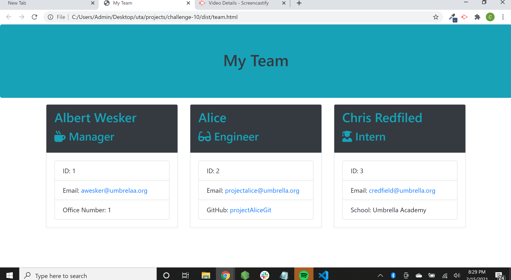

# HTML Team Generator

## Description 
This application will generate an HTML file that will render a software engineering team through the command line. The option exists to add a manager, engineers, and interns. The requested information for each type is as follows: for managers, the name, ID, email, and office number are required; for engineers, the name, ID, email, and GitHub accounts are requested; and for interns, the names, ID, email, and school they attended are requested. The user is not able to skip entering any steps or information becuase of validation functions written in the JavaScript files. The written JavaScript tests were written to fail first, then the corresponding JavaScript files were written to pass the tests. 

## Installation
To install necessary dependencies, run: npm install and inquirer. 

## Usage
To run this application, run: node index.js through the command line. 

### Built With 

 * HTML
 * JavaScript
 * Node.js
 * Inquirer
 * Bootstrap
 
 
